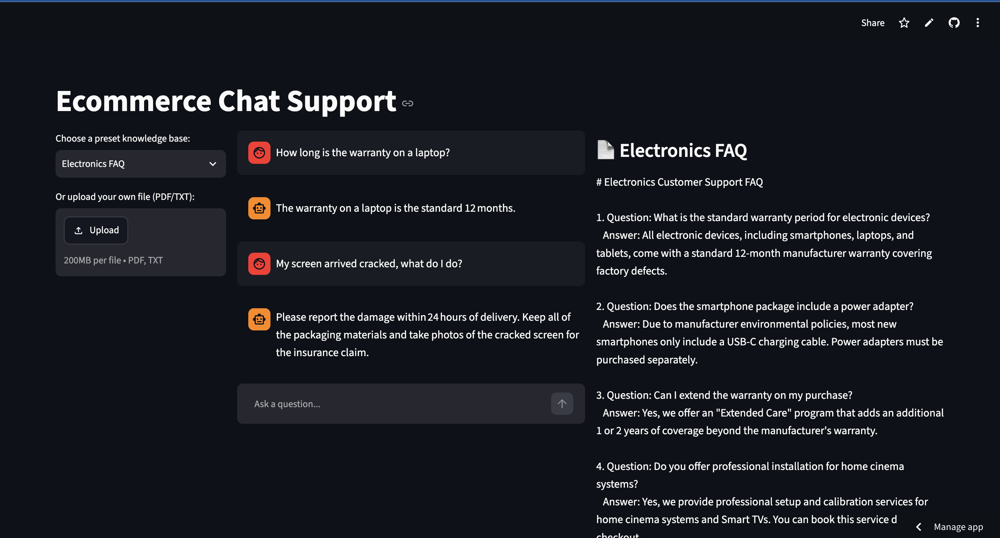
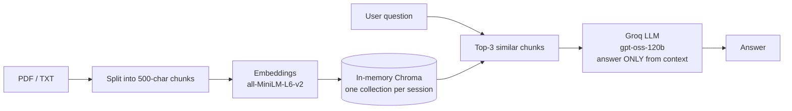
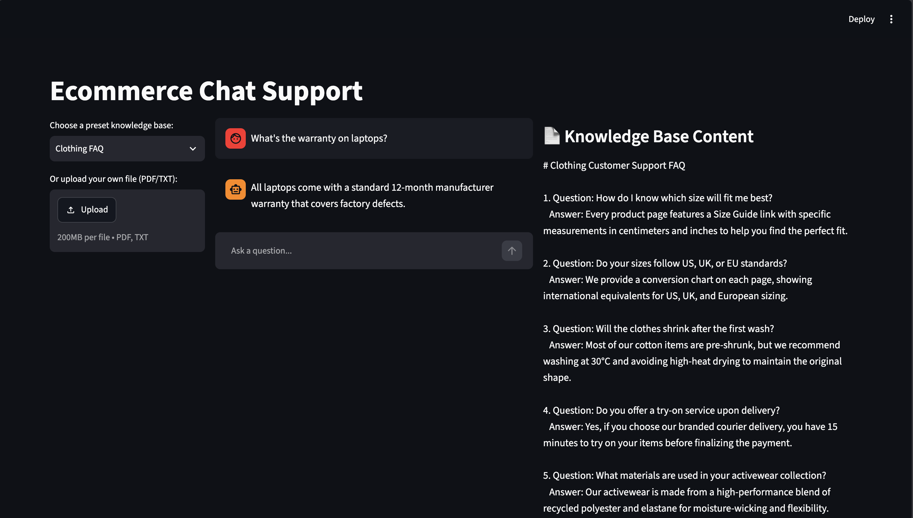
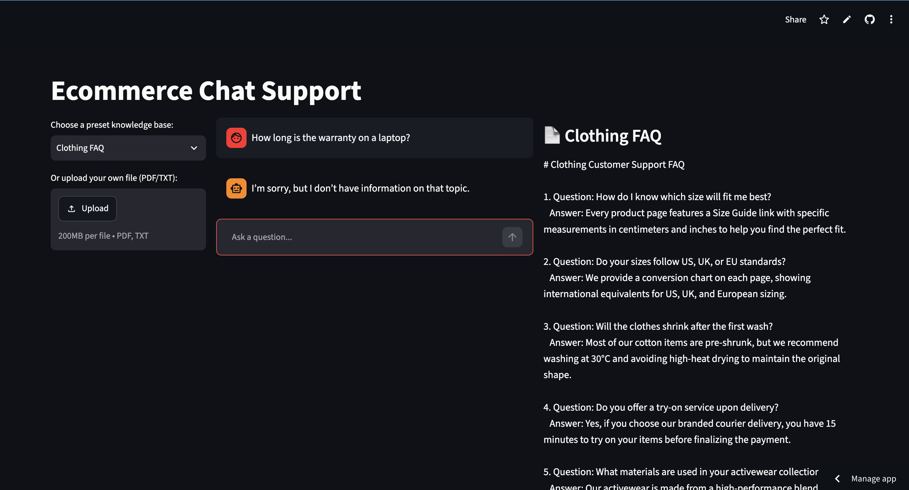

# E-Commerce Support Chatbot (RAG)

[](https://github.com/DanilRodenko/ecommerce-support-bot-v2/actions/workflows/ci.yml)

**Answers customer questions strictly from a store's own FAQ or policy documents — and says "I don't know" instead of making things up.**

🔗 **Live demo:** [ecommerce-support-bot-v2.streamlit.app](https://ecommerce-support-bot-v2.streamlit.app)



---

## Problem & Data

Small online stores answer the same questions again and again: returns, warranty, sizes, delivery. A generic LLM answers confidently but invents policies. This bot answers **only** from the documents you give it.

- **Data:** 4 sample knowledge bases — Clothing FAQ, Electronics FAQ (25 Q&A each, TXT) and two policy PDFs. You can also upload your own PDF/TXT.
- **User flow:** pick a knowledge base or upload a file → ask a question → get an answer grounded in that document, with the document shown next to the chat.

## Architecture



Key design decisions:

- **Per-session vector store.** Each user gets their own in-memory Chroma collection with a unique name, so documents from different users or knowledge bases never mix.
- **Shared resources are cached, user data is not.** The embedding model and Groq client are loaded once (`st.cache_resource`); the vector store and chat history live in `st.session_state`.
- **Dependency injection.** `ask()` receives the vector store, LLM client and model name as parameters, so it's unit-tested with a fake client — no API key or network needed in CI.
- **Model is configurable** via the `GROQ_MODEL` env variable, so a deprecated model is a config change, not a code change.

## Results / Evaluation

### Bug found and fixed: context leaking between knowledge bases

In the first version every document was written into one shared on-disk collection, and retrieval ignored the selected knowledge base. With **Clothing FAQ** selected, the bot answered a laptop warranty question with electronics data. On a public deployment this also meant one user's upload could leak into another user's answers.

| Before | After |
|---|---|
|  |  |

The fix is covered by a regression test (`test_vectorstores_are_isolated`).

### Offline evaluation — 24 questions

Questions are paraphrased (not copied from the FAQ) and include out-of-scope questions from the *other* knowledge base to check that the bot refuses instead of hallucinating. Answers are graded by an LLM judge.

| Metric | Result |
|---|---|
| Retrieval hit@3 (in-scope, n=18) | 18/18 (100%) |
| Answer accuracy (in-scope, n=18) | 18/18 (100%) |
| Correct refusals (out-of-scope, n=6) | 6/6 (100%) |
| Overall accuracy (n=24) | 24/24 (100%) |

Eval set: [`evaluation/eval_set.json`](evaluation/eval_set.json) · per-question results: [`evaluation/results.json`](evaluation/results.json)

**Limitations:** the eval set is small (24 questions) and each answer sits in a single FAQ entry,
so 100% here means "works on straightforward questions", not "production-ready".
The judge is the same model as the bot, which may bias grading. Next steps: a larger set with
multi-hop and ambiguous questions, and a different model as the judge.


## Tech Stack

Python 3.11 · LangChain · ChromaDB · sentence-transformers (all-MiniLM-L6-v2) · Groq API (gpt-oss-120b) · Streamlit · pytest · GitHub Actions

## Run Locally

```bash
git clone https://github.com/DanilRodenko/ecommerce-support-bot-v2.git
cd ecommerce-support-bot-v2
python3.11 -m venv .venv && source .venv/bin/activate
pip install -r requirements-dev.txt
echo 'GROQ_API_KEY=your_key_here' > .env

python -m streamlit run streamlit_app.py   # app
python -m pytest -v                         # unit tests
python -m evaluation.run_eval               # offline evaluation (uses Groq API)
```

## Project Structure

```
├── streamlit_app.py        # UI: layout, session state, caching
├── src/
│   ├── ingest.py           # load → split → embed → in-memory vector store
│   ├── retriever.py        # top-k similarity search
│   └── chain.py            # prompt + history + LLM call
├── evaluation/             # eval set + evaluation script
├── tests/                  # pytest unit tests (run in CI)
├── data/uploads/           # sample knowledge bases
└── .github/workflows/      # CI: pytest on every push and PR
```

## Next Steps

- Show source chunks under each answer so users can verify it.
- Add a similarity threshold so irrelevant chunks aren't sent to the LLM at all.
- Migrate document loaders off `langchain-community` (being sunset).
- Free Streamlit tier: the app sleeps after inactivity — first load can take ~30 s.

## Author

Danil Rodenko — [github.com/DanilRodenko](https://github.com/DanilRodenko) · [linkedin.com/in/danilrodenko](https://linkedin.com/in/danilrodenko)